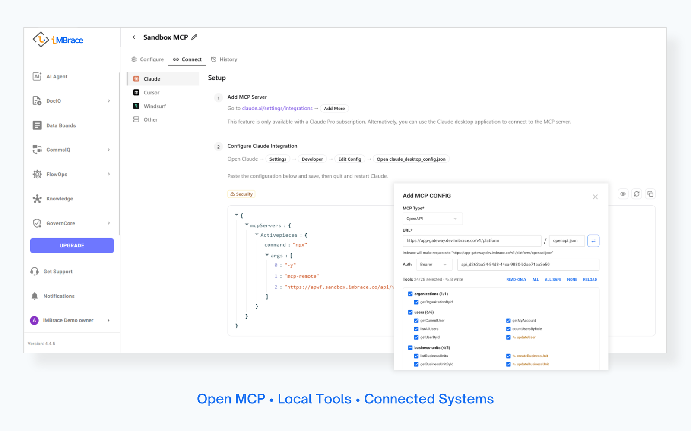

<p align="center">
  <a href="https://www.imbrace.co">
    
  </a>
</p>

<h1 align="center">iMBrace — Open-Source Enterprise AI OS</h1>

iMBrace Community Edition is a self-hosted, open-source AI Operating System built to keep your
company's intellectual property strictly on your infrastructure.

It gives developers and technical teams a transparent foundation to deploy context-aware AI
agents, stateful DAG workflows, and native MCP tool integrations—without sending sensitive
enterprise data to third-party clouds. Connect your local knowledge bases, route private LLMs,
and automate complex processes. When deployed with self-hosted models and storage, your data
stays inside your own environment. (Optional external providers such as OpenAI or Tavily, if
configured, send data outside your infrastructure.)

<p align="center">
  
</p>

---

## Key Capabilities

- **Data Sovereignty & Local Context:** Ingest unstructured data into local vector stores. Your
  intellectual property stays behind your firewall.
- **AI Agent Builder:** Deploy role-based agents powered by local LLMs (Ollama/vLLM) or private
  API endpoints with complete prompt transparency.
- **Stateful DAG Workflow Engine:** Orchestrate multi-step AI tasks, scheduled triggers, and
  communication webhooks over predictable execution paths.
- **Native MCP Gateway:** Expose internal tools, databases, and custom Python/Node scripts to
  agents using open Model Context Protocol standards.
- **Local System Telemetry:** Track execution paths, token consumption, and node latency in
  real-time. Export logs to Grafana/Prometheus.
- **Enterprise-Scale AI:** Scale beyond Community Edition with hybrid RAG and SQL, agent
  orchestration, enterprise access control, governance and auditability, multi-organization
  management, AI Copilot, and professional support.

---

## Quick start — run iMBrace with Docker Compose

The whole stack runs from one file: [`deploy/docker-compose.yml`](deploy/docker-compose.yml).
Every sidecar config (nginx ×2, Garage, Postgres init) is inlined as a Compose `config`, so
that single file *is* the deployment — 20 long-running containers plus 10 one-shot DB
init/migrate jobs, from 20 distinct images. All images are public (`docker.io/imbraceco`),
so no registry token is required.

### Requirements

Docker Engine 24+ and **Docker Compose v2.23.1+** (for inline `configs[].content`) on a
single Linux host, sized for a production workload:

| | Production | Notes |
|---|---|---|
| CPU | 8 cores (16 from ~50 concurrent users) | `amd64` or `arm64`. Steady state sits at ~1–2 cores; the peak is boot — 10 sequential init/migrate jobs, the Activepieces `nx` migration, and the pgvector index build. Workflow and RAG bursts are what consume the remaining headroom. |
| RAM | 24 GB | ~7.5 GB at rest, ~14.5 GB under load, so 24 GB leaves room for concurrency spikes without OOM-kills. Largest consumers: `apworkflow-api` (`WORKER_AND_APP`) + `apworkflow-worker` ≈ 2–5 GB, Kafka at `-Xmx1g` ≈ 1.5 GB, `chat-ai` ≈ 1–1.5 GB. |
| Disk | 100 GB SSD (NVMe preferred) | 11–16 GB of images (the three `apwf` tags share no layers, and both `postgres:18-alpine` and `pgvector/pgvector:pg18` are pulled); the rest is volumes that keep growing — Kafka retains 7 days of log, `worker-cache` grows per built piece, `pgdata` carries the pgvector embeddings. Postgres and pgvector are latency-sensitive, so put the Docker data root on SSD. |
| GPU | not used | No GPU service ships in this file. The AI features expect an **external** OpenAI-compatible endpoint — see `VLLM_URL` / `LLM_PROVIDER` on `chat-ai` and `ai-agent`. |
| Network | TLS terminator in front | Run the stack behind a reverse proxy / load balancer with your certificate and set `PUBLIC_SCHEME=https` + `WS_SCHEME=wss`. Expose only the ports you actually serve. |

Nothing enforces these numbers — the file declares no `mem_limit` and no
`deploy.resources`, so Docker will not stop you. Below them the stack still starts but runs
degraded, and too little RAM surfaces as random OOM-kills rather than a clear error.

Before going live, rotate every default credential and key (see the warning under
[Configuration](#configuration)), and schedule backups of the `pgdata` and object-storage
volumes — `docker compose down -v` deletes them irreversibly.

### Install

```bash
# grab just the one file — no clone, no submodules
curl -fsSLO https://raw.githubusercontent.com/imbrace-co/imbrace/main/deploy/docker-compose.yml

# start everything (defaults to localhost)
docker compose up -d

# or point it at the address browsers will use
PUBLIC_HOST=10.0.0.5 docker compose up -d
```

Startup order is encoded in the file: each DB init job waits for Postgres to be healthy,
every app waits for its init job to finish, the gateway waits for the backends, and the
frontends wait for the gateway. One `up -d` is enough.

```bash
docker compose ps            # status
docker compose logs -f app-gateway
docker compose down          # stop
docker compose down -v       # stop AND delete all data volumes
```

### Configuration

All values have defaults baked in, so a plain `up -d` works. Override with a `.env` file
next to the compose file, or inline on the command line:

| Variable | Default | Purpose |
|---|---|---|
| `PUBLIC_HOST` | `localhost` | Browser-facing IP/domain — no scheme, no port |
| `PUBLIC_SCHEME` | `http` | `http` or `https` |
| `WS_SCHEME` | `ws` | `ws` with http, `wss` with https |
| `POSTGRES_PASSWORD` | `changeme-postgres-pass` | Postgres superuser **and** the `imbrace` app role |
| `REDIS_PASSWORD` | `imbrace-dev-redis-pass` | Redis auth |
| `GARAGE_KEY_ID` / `GARAGE_KEY_SECRET` | empty | S3 keys, filled after the optional Garage bootstrap |
| `OPENAI_API_KEY` / `TAVILY_API_KEY` | empty | Optional external providers |

> ⚠️ **Before exposing the stack to a network,** change the seeded admin password
> (`NEW_ORG_PASSWORD`) and the JWT / encryption keys
> (`AP_ENCRYPTION_KEY`, `AP_JWT_SECRET`, `AP_WORKER_TOKEN`, channel `JWT_SECRET`,
> `WEBUI_SECRET_KEY`, `ENCRYPTION_SECRET_KEY`, Garage `rpc_secret`). They ship as fixed
> defaults, which means **every** install shares them until you rotate.

### Optional add-ons

The AI features (`chat-ai`, `ai-agent`) need an OpenAI-compatible LLM endpoint, which this
file does not ship. Point `VLLM_URL` / `VLLM_EMBEDDING_URL` at an external one, or switch
`LLM_PROVIDER` to `openai` / `bedrock` and set the matching key. DocIQ additionally needs a
reachable `docling-serve` in `DOCLING_SERVER_URL` — otherwise set `ENABLE_DOCIQ=false`.

Object storage is optional too: services default to local disk. To use the bundled Garage
S3 node, run the one-time bootstrap documented in the header of the compose file, then put
the printed key id/secret into `.env` as `GARAGE_KEY_ID` / `GARAGE_KEY_SECRET`.

### Access

| URL | Content |
|---|---|
| `http://<PUBLIC_HOST>:6868` | Dashboard — login `admin@imbrace.co` / `ChangeMe@12345` |
| `http://<PUBLIC_HOST>:6868/api` | app-gateway API |
| `http://<PUBLIC_HOST>:30700` | Workflow automation |
| `http://<PUBLIC_HOST>:30030` | insightIQ AI chat |
| `http://<PUBLIC_HOST>:30050` | Embeddable chat widget |
| `http://<PUBLIC_HOST>:30040` | AI agent (Next Best Action) |

---

## License

iMBrace is licensed under the **[MIT License](LICENSE)** — free to use, copy,
modify, and distribute, including for commercial purposes.

Each component repository carries its own `LICENSE`. Repositories forked from
other open-source projects retain their upstream license (e.g. Activepieces and
OpenAuth under MIT, the chatbot under Apache-2.0, the chat workspace under
BSD-3-Clause) — check the `LICENSE` file in each repo.

---

## Repositories

### Frontend
| Repo | Description | Stack |
|---|---|---|
| [imbrace-fe](https://github.com/imbrace-co/imbrace-fe) | Main webapp — admin / member workspace | Vite · React 18 · Redux Toolkit · PWA |
| [imbrace-chat-widget](https://github.com/imbrace-co/imbrace-chat-widget) | Embeddable chat widget (`<script>` drop-in) | Vite · React |


### Backend services
| Repo | Description | Stack |
|---|---|---|
| [platform](https://github.com/imbrace-co/platform) | Core platform — authentication, organizations, users, teams, SSO, licensing | Hono · Drizzle · PostgreSQL |
| [app-gateway](https://github.com/imbrace-co/app-gateway) | Self-hostable API gateway — auth, license verification, routing | Node · Express · TypeScript |
| [ai-agent](https://github.com/imbrace-co/ai-agent) | AI agent runtime (backend + web client) — tools, MCP, chat orchestration | Express · React · TypeScript |
| [chat-ai](https://github.com/imbrace-co/chat-ai) | AI chat service — runs OpenAPI/MCP tool-servers | Open WebUI-based |
| [channel](https://github.com/imbrace-co/channel) | Omnichannel service — channels, conversations, contacts, webhooks, WebSocket | Hono · TypeScript |
| [data_board](https://github.com/imbrace-co/data_board) | Data-board management — data / CRM / knowledge / document boards | Hono · Drizzle · PostgreSQL |
| [file](https://github.com/imbrace-co/file) | File service — upload, storage, presigned URLs | Hono · TypeScript |
| [marketplace](https://github.com/imbrace-co/marketplace) | Apps / templates / integrations hub | Node · TypeScript |

### Workflow
| Repo | Description | Stack |
|---|---|---|
| [workflow](https://github.com/imbrace-co/workflow) | Workflow automation engine | TypeScript · React |

---

## Working on the code

Each repository is self-contained and has its own README with setup instructions. Clone
the component you want to work on and follow its local README. A typical on-prem stack is
composed of the backend services above plus `imbrace-fe`.

[`deploy/docker-compose.yml`](deploy/docker-compose.yml) pins the currently published image
tag of every component, so it doubles as the reference for which versions are known to work
together. To run your own build of one service against the rest of the stack, drop a
`docker-compose.override.yml` next to it — Compose merges it automatically:

```yaml
services:
  data-board:
    image: my-local/data_board:dev
```

## Contributing

We welcome contributions. Please read:

- [CONTRIBUTING.md](CONTRIBUTING.md) — how to set up, branch, and open a PR, and the
  **license boundary** you must respect.
- [CODE_OF_CONDUCT.md](CODE_OF_CONDUCT.md) — the standards we hold each other to.

## Security

To report a vulnerability, please **do not** open a public issue — email
`security@imbrace.co` (see [SECURITY.md](SECURITY.md)).
