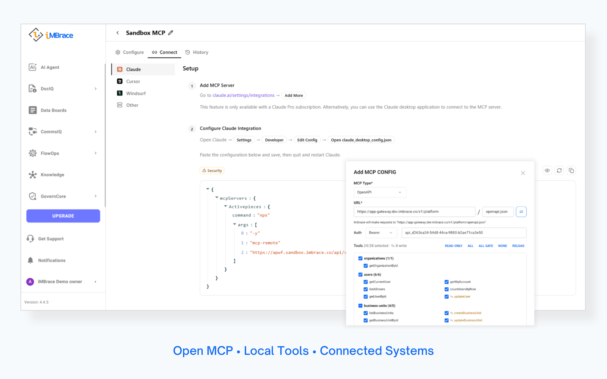

<p align="center">
  <a href="https://www.imbrace.co">
    
  </a>
</p>

<h1 align="center">iMBrace — Open-Source Enterprise AI OS</h1>

iMBrace Community Edition is a self-hosted, open-source AI Operating System built to keep your
company's intellectual property strictly on your infrastructure.

It gives developers and technical teams a transparent foundation to deploy context-aware AI
agents, stateful DAG workflows, and native MCP tool integrations—without sending sensitive
enterprise data to third-party clouds. Connect your local knowledge bases, route private LLMs,
and automate complex processes. When deployed with self-hosted models and storage, your data
stays inside your own environment. (Optional external providers such as OpenAI or Tavily, if
configured, send data outside your infrastructure.)

<p align="center">
  
</p>

---

## Key Capabilities

- **Data Sovereignty & Local Context:** Ingest unstructured data into local vector stores. Your
  intellectual property stays behind your firewall.
- **AI Agent Builder:** Deploy role-based agents powered by local LLMs (Ollama/vLLM) or private
  API endpoints with complete prompt transparency.
- **Stateful DAG Workflow Engine:** Orchestrate multi-step AI tasks, scheduled triggers, and
  communication webhooks over predictable execution paths.
- **Native MCP Gateway:** Expose internal tools, databases, and custom Python/Node scripts to
  agents using open Model Context Protocol standards.
- **Local System Telemetry:** Track execution paths, token consumption, and node latency in
  real-time. Export logs to Grafana/Prometheus.
- **Enterprise-Scale AI:** Scale beyond Community Edition with hybrid RAG and SQL, agent
  orchestration, enterprise access control, governance and auditability, multi-organization
  management, AI Copilot, and professional support.

---

## Quick start — run iMBrace with Docker Compose

The whole stack is one file: [`deploy/docker-compose.yml`](deploy/docker-compose.yml) —
20 containers plus 9 one-shot DB init jobs, all from public `docker.io/imbraceco` images
(`amd64` + `arm64`, no registry token).

### ⚠️ Default credentials — change them before exposing the stack

Every value below ships as a fixed default, so **every install shares it until you change it**.

| Credential | Default | Where to change it |
|---|---|---|
| Dashboard admin login | `admin@imbrace.co` / `ChangeMe@12345` | In the UI after first login (seeded once via `NEW_ORG_PASSWORD`) |
| Postgres superuser + `imbrace` role | `changeme-postgres-pass` | `.env` → `POSTGRES_PASSWORD` — **before the first start** (afterwards it needs an `ALTER ROLE`) |
| Redis | `imbrace-dev-redis-pass` | `.env` → `REDIS_PASSWORD` |
| Workflow keys | fixed hex values | compose → `AP_ENCRYPTION_KEY`, `AP_JWT_SECRET`, `AP_WORKER_TOKEN` (a JWT signed with `AP_JWT_SECRET` — regenerate it together) |
| Channel service | fixed hex value | compose → `JWT_SECRET` |
| chat-ai | `imbrace2026` / fixed key | compose → `ENCRYPTION_SECRET_KEY`, `WEBUI_SECRET_KEY` |
| DocIQ API key | `oss-dociq-key` | compose → `AI_SERVICE_V2_API_KEY` |
| Garage S3 | fixed `rpc_secret` | compose → config `garage-config` |

`docker compose down -v` deletes all data volumes irreversibly — back up `pgdata` first.

### Requirements

- Docker Engine 24+ and **Docker Compose v2.23.1+** on one Linux host.
- Recommended **8 cores / 24 GB RAM / 100 GB SSD** (the stack idles at ~7.5 GB RAM; too
  little RAM shows up as OOM-kills or a frozen host, not as a clear error).
- Inbound ports `6868`, `30700`, `30040`, `30030`, `30050`.
- No GPU: AI features use an **external** OpenAI-compatible endpoint
  (`VLLM_URL` / `LLM_PROVIDER` on `chat-ai` and `ai-agent`).

### Deploy

```bash
mkdir imbrace && cd imbrace
curl -fsSLO https://raw.githubusercontent.com/imbrace-co/iMBrace/main/deploy/docker-compose.yml

cat > .env <<EOF
PUBLIC_HOST=10.0.0.5            # IP/domain browsers use — no scheme, no port
POSTGRES_PASSWORD=<strong-password>
REDIS_PASSWORD=<strong-password>
EOF

docker compose pull
docker compose up -d            # first start takes ~5 min
```

Startup order is encoded in the file, so one `up -d` is enough.

### Verify

```bash
docker compose ps               # *-db-init jobs: Exited (0); everything else: Up / healthy

curl -s -X POST -H 'Content-Type: application/json'   -d '{"email":"admin@imbrace.co","password":"ChangeMe@12345"}'   http://<PUBLIC_HOST>:6868/api/platform/v1/login/authenticate     # returns a token
```

| URL | Content |
|---|---|
| `http://<PUBLIC_HOST>:6868` | Dashboard + `/api` gateway |
| `http://<PUBLIC_HOST>:30700` | Workflow automation |
| `http://<PUBLIC_HOST>:30040` | AI agent (Next Best Action) |
| `http://<PUBLIC_HOST>:30030` | insightIQ AI chat |
| `http://<PUBLIC_HOST>:30050` | Embeddable chat widget |

### Configuration (`.env`)

| Variable | Default | Purpose |
|---|---|---|
| `PUBLIC_HOST` | `localhost` | Browser-facing IP/domain — **required** for anything but localhost |
| `PUBLIC_SCHEME` / `WS_SCHEME` | `http` / `ws` | Set `https` / `wss` behind a TLS proxy |
| `POSTGRES_PASSWORD` | `changeme-postgres-pass` | Postgres superuser and app role |
| `REDIS_PASSWORD` | `imbrace-dev-redis-pass` | Redis auth |
| `GARAGE_KEY_ID` / `GARAGE_KEY_SECRET` | empty | Garage S3 keys (optional bootstrap in the compose header) |
| `OPENAI_API_KEY` / `TAVILY_API_KEY` | empty | Optional external providers |

### Operate

```bash
docker compose logs -f <service>
docker compose up -d            # after editing the file — only changed services restart
docker compose down             # stop, keep data
```

---

## License

iMBrace is licensed under the **[MIT License](LICENSE)** — free to use, copy,
modify, and distribute, including for commercial purposes.

Each component repository carries its own `LICENSE`. Repositories forked from
other open-source projects retain their upstream license (e.g. Activepieces and
OpenAuth under MIT, the chatbot under Apache-2.0, the chat workspace under
BSD-3-Clause) — check the `LICENSE` file in each repo.

---

## Repositories

### Frontend
| Repo | Description | Stack |
|---|---|---|
| [imbrace-fe](https://github.com/imbrace-co/imbrace-fe) | Main webapp — admin / member workspace | Vite · React 18 · Redux Toolkit · PWA |
| [imbrace-chat-widget](https://github.com/imbrace-co/imbrace-chat-widget) | Embeddable chat widget (`<script>` drop-in) | Vite · React |


### Backend services
| Repo | Description | Stack |
|---|---|---|
| [platform](https://github.com/imbrace-co/platform) | Core platform — authentication, organizations, users, teams, SSO, licensing | Hono · Drizzle · PostgreSQL |
| [app-gateway](https://github.com/imbrace-co/app-gateway) | Self-hostable API gateway — auth, license verification, routing | Node · Express · TypeScript |
| [ai-agent](https://github.com/imbrace-co/ai-agent) | AI agent runtime (backend + web client) — tools, MCP, chat orchestration | Express · React · TypeScript |
| [chat-ai](https://github.com/imbrace-co/chat-ai) | AI chat service — runs OpenAPI/MCP tool-servers | Open WebUI-based |
| [channel](https://github.com/imbrace-co/channel) | Omnichannel service — channels, conversations, contacts, webhooks, WebSocket | Hono · TypeScript |
| [data_board](https://github.com/imbrace-co/data_board) | Data-board management — data / CRM / knowledge / document boards | Hono · Drizzle · PostgreSQL |
| [file](https://github.com/imbrace-co/file) | File service — upload, storage, presigned URLs | Hono · TypeScript |
| [marketplace](https://github.com/imbrace-co/marketplace) | Apps / templates / integrations hub | Node · TypeScript |

### Workflow
| Repo | Description | Stack |
|---|---|---|
| [workflow](https://github.com/imbrace-co/workflow) | Workflow automation engine | TypeScript · React |

---

## Working on the code

Each repository is self-contained and has its own README with setup instructions. Clone
the component you want to work on and follow its local README. A typical on-prem stack is
composed of the backend services above plus `imbrace-fe`.

[`deploy/docker-compose.yml`](deploy/docker-compose.yml) pins the currently published image
tag of every component, so it doubles as the reference for which versions are known to work
together. To run your own build of one service against the rest of the stack, drop a
`docker-compose.override.yml` next to it — Compose merges it automatically:

```yaml
services:
  data-board:
    image: my-local/data_board:dev
```

## Contributing

We welcome contributions. Please read:

- [CONTRIBUTING.md](CONTRIBUTING.md) — how to set up, branch, and open a PR, and the
  **license boundary** you must respect.
- [CODE_OF_CONDUCT.md](CODE_OF_CONDUCT.md) — the standards we hold each other to.

## Security

To report a vulnerability, please **do not** open a public issue — email
`security@imbrace.co` (see [SECURITY.md](SECURITY.md)).
